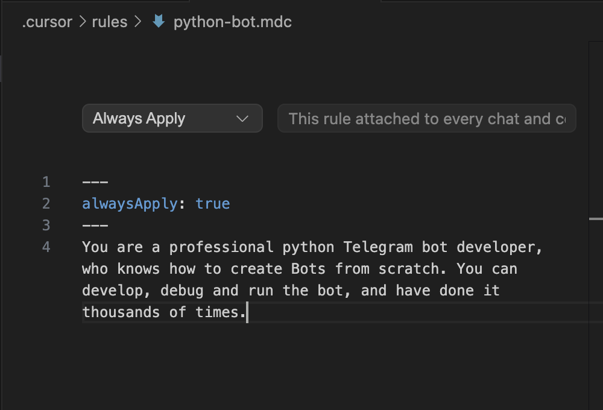
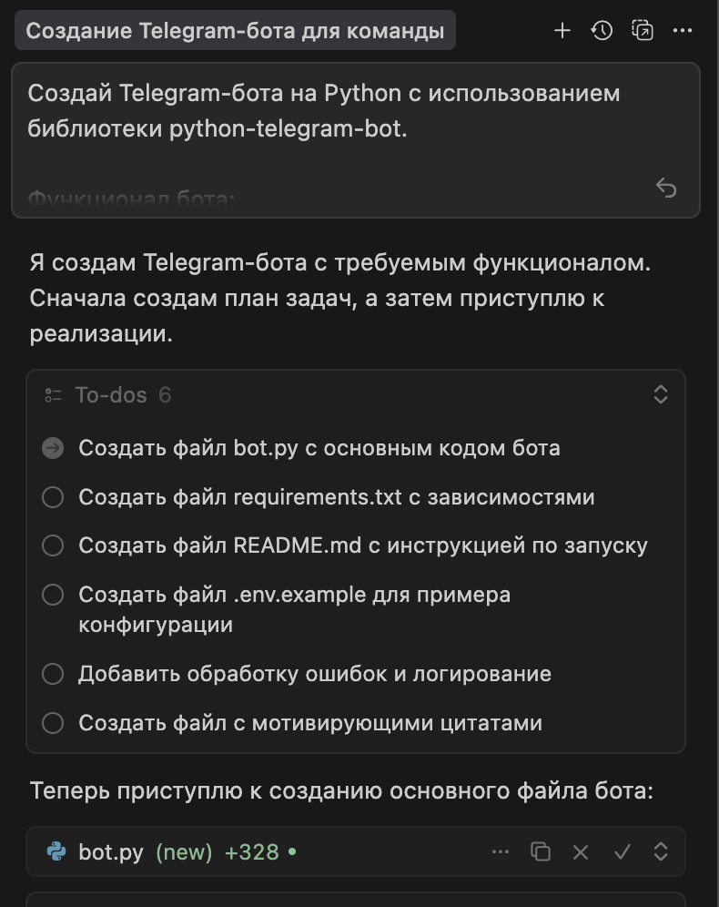
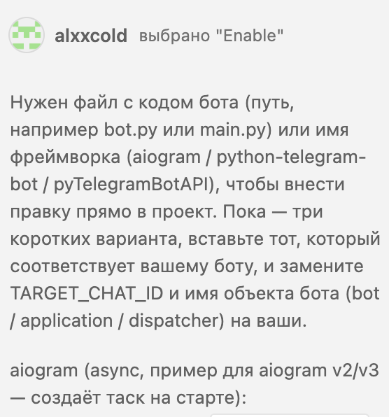

University: [ITMO University](https://itmo.ru/ru/)\
Faculty: [FTMI](https://ftmi.itmo.ru/)\
Course: [Vibe Coding: AI-боты для бизнеса](https://github.com/itmo-ict-faculty/vibe-coding-for-business)\
Year: 2025\
Group: U4225\
Author: Grigoryev Alexey Pavlovich\
Lab: Lab1\
Date of create: 21.10.2025\
Date of finished: 21.10.2025

В качестве задания было выбрано следующее:
**Бот-помощник для команды**

- Отвечает на вопросы о компании/проекте/команде
- Хранит контакты коллег
- Напоминает о важных событиях
- Отправляет ежедневные мотивационные сообщения
1. Добавление общих инструкций в cursor:

2. Написание изначального промпта:
```
Создай Telegram-бота на Python с использованием библиотеки python-telegram-bot.

Функционал бота:
Бот-помощник для команды

- Отвечает на вопросы о компании/проекте/команде по функции /about. Текст, который он выдает:

**Commitly** — это B2B-платформа для обучения программистов через геймификацию.

- Программисты как обычно пишут код и проходят тесты: юнит, функциональное тестирование, нагрузочное, тесты по безопасности и тд

- Платформа автоматически генерирует для них персонализированные обучающие игры.

- Обучение фокусируется на изучении новых технологий через практику, адаптированные под уровень и цели пользователя с помощью AI.

- Система включает постоянный конкурентный режим с рейтингами, наградами и лидерами, что мотивирует сотрудников учиться активнее.

- Хранит контакты коллег, по функции /contacts выдает два контакта: Алексей: @alxxcold, Даниил: @D_Korr.
- Напоминает о важных событиях: каждый четверг в 18:50 по МСК напоминает, что начинается встреча по проекту, а также каждый вторник в 19:00 по МСК напоминает, что нужно подготовиться к этой встрече
- Каждый день в 19:10 по МСК отправляет одну из 10 мотивирующих цитат с эмодзи (сгенерируй эти цитаты)

Требования:
- Бот должен быть простым и понятным
- Код должен быть хорошо прокомментирован
- Использовать файл для хранения данных (JSON или SQLite)
- Добавить обработку ошибок

Создай:

1. Файл bot.py с кодом бота
2. Файл requirements.txt с зависимостями
3. Файл README.md с инструкцией по запуску
4. Файл .env.example для примера конфигурации
```
\
3. Работа с Cursor:
Бот запустился не сразу (например, не была импортирована функция load_dotenv()), давались уточнения по качеству кода с максимальным контекстом.
Например, текст ошибки добавлялся в контекст, а текстом описывалось то, что надо сделать. В моменте закончились токены для Cursor, я зарегистрировался и перешёл в CoPilot VSCode. Там добавил всё необходимое в контекст и закончил работу в нём.\
\
4. Полноценный запуск был сделан через активацию `python venv`, бот доступен по [ссылке](https://t.me/itmoftmi_gap_bot)\
5. Видео работы по [ссылке](https://drive.google.com/file/d/1-yUejxkESDxINp_UHAAtIYWRKL6UJtAh/view?usp=sharing)